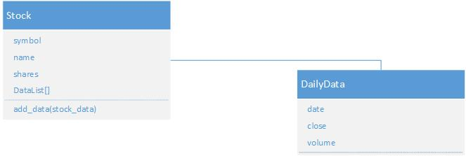
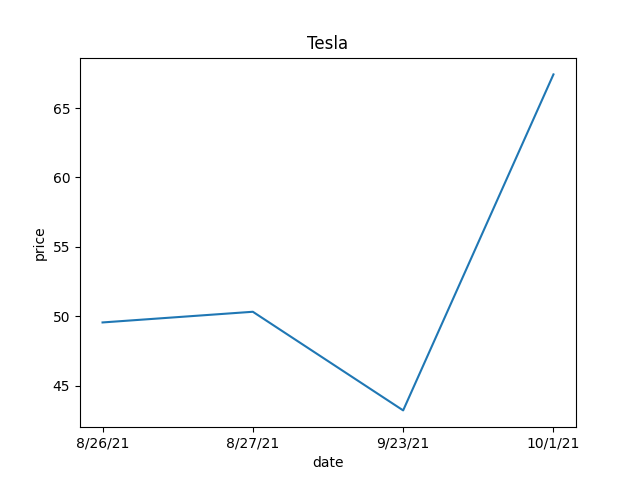
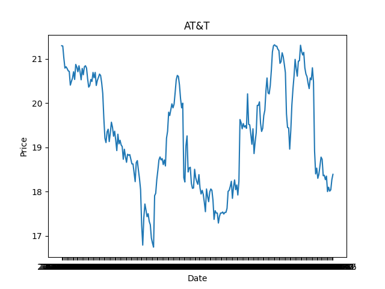

# Stock Tracking Application

## Overview

- Software Program that allows you to buy, sell, import stock data, and display stock report and chart
- Includes dependencies installed:
  - Beautiful Soup
  - Selenium
  - CSV
  - Pandas
  - DateTime
  - OS
  - Tkinter
  
## Class Diagram
I created a table diagram in Visio laying out the classes and their functions. In this example, DailyData is connected to Stock class.

    
## Additional Screenshots

  
  
